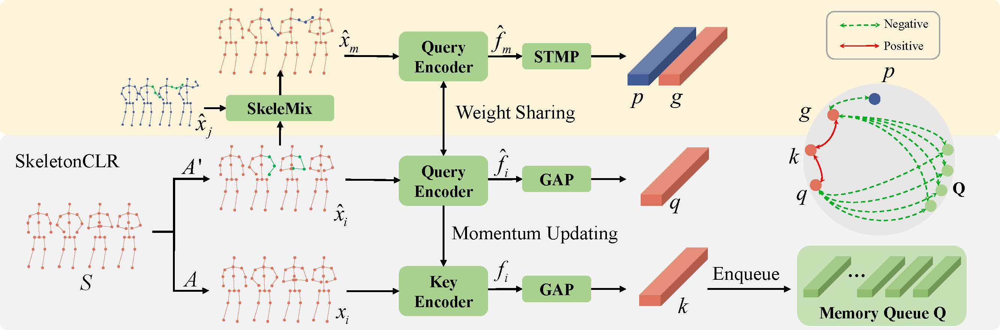

# SkeleMixCLR

The Official PyTorch implementation of **"Contrastive Learning from Spatio-Temporal Mixed Skeleton Sequences for Self-Supervised Skeleton-Based Action Recognition"**. The arXiv version of our paper is coming soon.

<div align=center>
    
</div>

## Requirements
We only test our code on the following environment:
  - SkeleMixCLR
  - Python == 3.8.2
  - PyTorch == 1.4.0
  - CUDA == 11.1
  - GPU == GeForce RTX 2080 Ti
  
  - SkeleMixCLR+
  - Python == 3.8.2
  - PyTorch == 1.9.0
  - CUDA == 11.1
  - GPU == GeForce RTX 3090
  
## Installation
  ```bash
  # Install python environment
  $ conda create -n skelemixclr python=3.8.2
  $ conda activate skelemixclr

  # Install PyTorch
  $ pip install torch==1.4.0
  # or
  $ pip install torch==1.9.0

  # Download our code
  $ git clone https://github.com/czhaneva/SkeleMixCLR.git
  $ cd SkeleMixCLR

  # Install torchlight
  $ cd torchlight
  $ python setup.py install
  $ cd ..

  # Install other python libraries
  $ pip install -r requirements.txt
  ```

## Data Preparation
- We use [NTU RGB+D](https://www.cv-foundation.org/openaccess/content_cvpr_2016/papers/Shahroudy_NTU_RGBD_A_CVPR_2016_paper.pdf) and [NTU RGB+D 120](https://arxiv.org/pdf/1905.04757.pdf) as our datasets.
- Please click [here](http://rose1.ntu.edu.sg/Datasets/actionRecognition.asp) for more information about accessing the "NTU RGB+D" and "NTU RGB+D 120" datasets.
- Only the **3D skeleton** modality is required in our experiments, you could also obtain it via [NTURGB-D](https://github.com/shahroudy/NTURGB-D).
- Please put the raw data in the directory `<path to nturgbd+d_skeletons>` and build the NTU RGB+D database as:

  ```bash
  # generate raw database for NTU-RGB+D
  $ python tools/ntu_gendata.py --data_path <path to nturgbd+d_skeletons>

  # preprocess the above data for our method (for limited computing power, we resize the data to 64 frames)
  $ python feeder/preprocess_ntu.py
  ```

## Unsupervised Pre-Training

- Example for unsupervised pre-training of **SkeleMixCLR+**. You can train other models by using other `.yaml` files in `config/` folder.
  ```bash
  # train on NTU-RGB+D xview
  $ python main.py pretrain_skeletonclr_multi_swapv2 --config config/CrosSCLR/skelemixclr_multi_swap_ntu.yaml.yaml
  ```
- The pre-trained models are in the directory: `weights/`

## Linear Evaluation

- Example for linear evaluation of **SkeleMixCLR+**. You can evaluate other models by using other `.yaml` files in `config/linear_eval` folder.
  ```bash
  # evaluate pre-trained model on NTU-RGB+D xview
  $ python main.py linear_evaluation --config config/linear_eval/linear_eval_skelemixclr_multi_swap_ntu.yaml --weights <path to weights>
  ```
  
 ## Results

The **Top-1 accuracy** results on two datasets for the linear evaluation of our methods with joint stream are shown here.
The extraction code for the weight is 2022.

| Model          | NTU 60 xsub (%) | NTU 60 xview (%) | NTU 120 xsub (%) | NTU 120 xset (%) |
| :------------- | :-------------: | :--------------: | :--------------: | :--------------: |
| SkeletonCLR    |       68.3      |       76.4       |       56.8       |       55.9       |
| SkeleMixCLR    |       79.6      |       84.4       |       67.4       |       69.6       |
| SkeleMixCLR+   |       80.7  [weight](https://pan.baidu.com/s/1ecWGwlUrew0NaEAOuhEyTg)    |       85.5 [weight](https://pan.baidu.com/s/1-Jaqrd2LGOpU8KEVRR0Eig) |       69.0 [weight](https://pan.baidu.com/s/1n2fQXOmUD8EfkyMsscjWqA)      |       68.2  [weight](https://pan.baidu.com/s/1eSLmcLiv9ZNfjF4kCkiLFQ)     |

---

## Citation
Please cite our paper if you find this repository useful in your resesarch:

```
@inproceedings{chen2022skelemixclr,
  Title          = {Contrastive Learning from Spatio-Temporal Mixed Skeleton Sequences for Self-Supervised Skeleton-Based Action Recognition},
  Author         = {Zhan, Chen and Hong, Liu and Tianyu, Guo and Zhengyan, Chen and Pinhao, Song and Hao, Tang},
  Booktitle      = {arXiv},
  Year           = {2022}
}
```

## Acknowledgement
- The framework of our code is based on - [CrosSCLR](https://github.com/LinguoLi/CrosSCLR).

